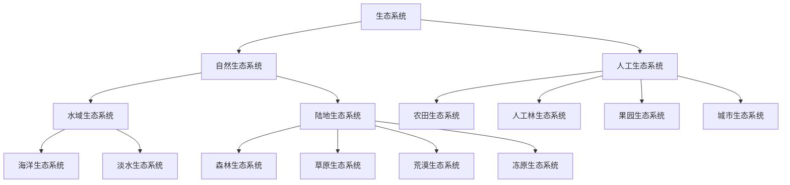

## 知识聚焦

​	**在*一定空间内*，由*生物群落与它的非生物环境*相互作用而形成的统一整体，称为*生态系统***。地球上的全部生物及其非生物环境的总和，构成地球上最大的生态系统**生态圈**。

### 一、生态系统的结构

#### 1. 生态系统的分类

​	根据生态系统的组成因素，可以分为自然生态系统（进而划分）和人工生态系统两大类。

#### 2. 生态系统的结构

##### 生态系统的组成结构

​	生态系统由相似的组成成分构成：

1. **非生物的物质和能量**：光、热、水、空气、无机盐等。
    1. 非生物的物质和能量是生态系统中**生物群落的物质和能量的最终来源**。
2. **生产者**：自养生物，主要为绿色植物。
    1. 生产者是生态系统中**唯一能把无机物合成为有机物并固定能量**的成分，是**生态系统的*基石***。
3. **消费者**：动物，包括植食性动物、肉食性动物、杂食性动物和寄生动物等。
    1. 消费者能将有机物转化为无机物，**加快生态系统的物质循环**，促进植物传粉与种子的传播，**是生态系统的重要成分，但不是必要成分**。
4. **分解者**：能将动植物遗体残骸中的有机物分解为无机物的生物，主要是细菌和真菌。
    1. 分解者能将动植物遗体和动物的排遗物中所含的有机物分解为无机物，并返还给非生物环境，保证物质循环的顺利进行，是**生态系统中必不可缺的成分**。

##### 生态系统的营养结构

​	生态系统中的各种生物之间通过食物关系形成的一种关系，称为**食物链**，有捕食链、寄生链和腐生链三种，最常见的是捕食食物链。

​	在捕食食物链中，**生产者为第一营养级，植食性动物（初级消费者）为第二营养级，肉食性动物占据第三、第四……营养级**，一般不会超过五个营养级**（能量流动顺食物链而*逐级递减*，*传递效率只有 $10\% \sim 20\%$*）**。==某一营养级的生物代表处于该营养级的所有生物，而不代表单个生物个体或单个种群==。

​	在生态系统中，许多食物链彼此交错连接成的复杂营养关系称为**食物网**。食物网的复杂性是生态系统保持相对稳定的重要条件，一般而言，食物网越复杂，生态系统抵抗外界干扰的能力就越强。

​	食物链和食物网是生态系统的营养结构，也是生态系统中能量流动和物质循环的渠道。

### 二、生态系统的能量流动

#### 1. 生态系统的能量来源与去向

1. 能量来源：**生产者通过光合作用固定太阳能**（光能 => 体内有机物能量 => 热能）。
2. ==流经一个生态系统的总能量是生产者固定太阳能的总量==。
3. 传递途径：食物链和食物网，以有机物中化学能为传递载体。
4. ==能量散失的主要途径为以热能形式散失的呼吸作用==。

#### 2. 生态系统能量流动过程图

1. 生产者的能量来源于光合作用固定的太阳嫩，消费者的能量一般来源于上级营养级，分解者的能量来源于生产者与消费者。
2. 对消费者而言，流入本营养级的能量应该是本营养级生物的同化量。
3. 能量去向一般只考虑自身呼吸作用消耗、流入下一营养级以及被分解者利用，但也可能需要考虑未利用的部分。

​	**生态系统中的能量的特点是*单向流动、逐级递减***，能量传递效率为 $\dfrac{某一营养级的同化量}{上一营养级的同化量}\times100\%$，传递效率一般为 $10\%\sim20\%$。

#### 3. 生态循环的金字塔

1. 数量金字塔通常呈现正金字塔形，少数如树与树上虫鸟则为倒金字塔。
2. 生物量金字塔、能量金字塔一般为正金字塔形。

### 三、生态系统的物质循环

​	生态系统的**物质循环**指生物体的碳氢氧磷氮硫等**元素**在**非生物环境与生物群落之间**的循环过程，带有全球性、循环性，又称为生物地球化学循环。

#### 1. 碳循环

1. 碳进入生物群落的途径：绿色植物的的光合作用与微生物的化能合成作用。
2. 碳在生物群落与非生物环境间以 $\ce{CO2}$ 为载体循环。
3. 碳在生物群落内部以有机物为载体循环。
4. 碳返回非生物环境的途径为呼吸作用、分解作用与化石燃料的燃烧。

#### 2. 生物富集作用

​	设；生物体从周围环境吸收、积蓄某种**有害元素或难以降解的化合物**，使其在生物体内部的浓度超出环境浓度的现象称为生物富集作用。==营养级越高，有害物质的浓度越高==。

#### 探究·实践：探究土壤微生物的分解作用

​	没什么好说的……

### 三、生态系统的信息传递

#### 1. 生态系统的信息类型

​	在日常生活中，人们通常将可以传播的消息、情报、指令、数据与信号等称作**信息**。生态系统中的生物种群之间，以及它们内部都有信息的产生与交换，能够形成信息传递，即**信息流**。 

1. 自然界中的光、声、温度、湿度、磁场等，通过物理过程传递的信息，称为**物理信息**。 上述蜘蛛网的振动频率与狼的呼叫声均为物理信息。物理信息的来源可以是非生物环境，也可以是生物个体或群体，这类信息十分普遍。
2. 在生命活动中，生物还产生一些可以传递信息的化学物质，如植物的生物碱、有机酸等代谢产物，以及动物的性外激素等，是**化学信息**，它们对其他生物有不同影响。科学实验表明，昆虫、鱼类以及哺乳类等生物体中都存在能传递信息的化学物质——信息素。
3. 动物的特殊行为，主要指各种动作，这些动作也能够向同种或异种生物传递某种信息，即动物的行为特征可以体现为**行为信息**。

​	在生态系统中的信息传递过程中，不仅有信息产生的部位——**信息源**；也有信息传播的媒介——**信道**，空气、水以及其他介质均可以传播信息；还需要信息接收的生物或其部位—信息受体，动物的眼、鼻、耳、皮肤，植物的叶、芽以及细胞中的特殊物质如光敏色素）等可以接收多样化的信息。

​	==信息传递影响生物的**生长、发育、繁殖，以及取食、居住、社会行为**等。生命活动的正常进行，离不开信息的作用；生物种群的繁衍，也离不开信息的传递。信息还能够**调节生物的种间关系**，进而维持生态系统的平衡与稳定==。

#### 2. 物质循环与能量流动

1. 同时进行、相互依存、不可分割。
2. 物质循环是可循环的，能量流动是单向、逐级递减、不可循环的，信息传递通常是双向的。

### 四、生态系统的稳定性

​	**生态系统的*结构和功能*保持相对稳定的一种状态称为*生态平衡***。对抗外界的破坏或干扰，使生态系统恢复平衡的调节机制，是**负反馈机制**。所谓负反馈，是指在一个系统中，系统工作的效果，反过来又作为信息调节该系统的工作，并且使系统工作的效果减弱或受到限制，它可使系统保持稳定。

​	==负反馈调节在生态系统中普遍存在，它是生态系统具备**自我调节能力的基础**==。生态系统维持或恢复自身结构与功能处于相对平衡状态的能力，叫作**生态系统的稳定性**。

​	生态系统的稳定性表现在两个方面：一方面是**生态系统抵抗外界干扰并使自身的结构与功能保持原状（不受损害）的能力，叫作*抵抗力稳定性***；另 一方面是**生态系统在受到外界干扰因素的破坏后恢复到原状的能力，叫作*恢复力稳定性***。==一般来说，生态系统中的组分越多，食物网越复杂。其自我调节能力就越强，抵抗力稳定性就越高。==

|          | 抵抗力稳定性                               | 恢复力稳定性                                       |
| -------- | ------------------------------------------ | -------------------------------------------------- |
| 核心     | 抵抗干扰，保持原状                         | 遭到破坏，恢复原状                                 |
| 影响因素 | 成分越复杂，抵抗力稳定性越高               | 成分越简单，恢复力稳定性越高                       |
| 联系     | 一般抵抗力稳定性高的生态系统恢复力稳定性低 | 同时存在的截然不同的作用力，共同维持生态系统的稳定 |

