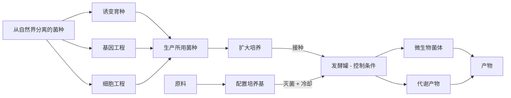

## 知识聚焦

> ##### 本章知识内容较多，考察点较细，需要牢记相关知识。

### 一、发酵与传统发酵技术

***发酵*是指人们利用微生物，在适宜的条件下，将原料通过微生物的代谢转化为人类所需要的产物**。

***传统发酵技术*是指直接利用原材料中天然存在的微生物，或前一次发酵保存下来的面团、卤汁等发酵物中的微生物进行发酵、制作食品的技术**。

|          | 泡菜                               | 果酒                                                         | 果醋                                                         | 腐乳       |
| -------- | ---------------------------------- | ------------------------------------------------------------ | ------------------------------------------------------------ | ---------- |
| 菌种     | 乳酸菌                             | 酵母菌                                                       | 酵母菌、醋酸菌（或醋酸菌）                                   | 毛霉、曲霉 |
| 代谢类型 | 异养厌氧型                         | 异养需氧型                                                   | 异养兼性厌氧型                                               | 异养厌氧型 |
| 细胞类型 | 细菌                               | 真菌                                                         | 细菌                                                         | 真菌       |
| 代谢温度 | 20-30 ℃                             | 18-30 ℃                                                       | 30-35 ℃                                                       | 17 ℃        |
| 时间     | 4-7 天                              | 10-12 天                                                      | 7-8 天                                                        | 10-15 天    |
| pH       | 酸性                               | 酸性                                                         | 酸性                                                         | 中性       |
| 代谢原理 | $\ce{C6H12O6 ->[酶] 2C3H6O3 + energy}$ | $\ce{C6H12O6 + 6O2 ->[酶] 6CO2 + 12H2O + energy}$ $\ce{C6H12O6 ->[酶] 2C2H5OH + 2CO2 + energy}$ | $\ce{C6H12O6 + 2O2 ->[酶] 2CH3COOH + 2CO2 + 2H2O +energy}$ $\ce{C2H5OH + O2 ->[酶] CH3COOH + H2O + energy}$ | 蛋白质水解：$\ce{Protein + H2O ->[酶] \text{a.a.}}$ |
| 相关鉴定 | 亚硝酸盐：==盐酸酸化条件下亚硝酸盐与对氨基苯磺酸反应后，与 N-1-萘基乙二胺盐酸盐结合形成玫瑰红色染料。== | 酒精：$\ce{K2CrO4(aq, H^+)}$ | 醋酸：闻气味、检测 pH |  |
| 制作过程 | 1. 配置盐水（清水：食盐配置百分比 5%-20%），煮沸冷却。  2. 加入蒜瓣、生姜和其他香辛料，继续装至八分满。  3. 缓缓倒入冷却的盐水，使盐水没过全部菜料，盖好坛盖。 4. 向坛盖边沿水槽注水，并注意经常向水槽中补满水。室温发酵。 | 1. 清洗发酵瓶、榨汁机等工具，用 70%酒精消毒、晾干。 2. 挑选并冲洗新鲜葡萄，用清水冲洗 1-2 次，去除枯梗和腐烂的坏果，沥干。 3. 用榨汁机榨取葡萄汁，装入发酵瓶中，留有$\frac{1}{3}$的空间。 4. 控制温度在 18-30 ℃，发酵 10-12 天，每隔 12h 左右拧松瓶盖排气。 | 在果酒的基础上： 5. 打开瓶盖，盖上纱布，控制温度在 30-35 ℃，发酵 7-8 天。 | 前期发酵： 1. 让豆腐上生出毛霉。 2. 加盐腌制。 后期发酵（抑制毛霉生长，改变口感风味）： 3. 加卤汤，装瓶。 4. 密封腌制。 |
| 注意事项 | 1. 煮沸盐水：除去水中溶解氧；杀灭水中其他杂菌。 2. ==亚硝酸盐不是致癌物==，亚硝酸盐的代谢产物**亚硝胺**才是致癌物。 3. 泡菜坛盖边注满水用以保证乳酸菌发酵的无氧环境，需要及时补充水。 4. 泡菜坛需要选择透气性差、无裂纹、火候好、无沙眼、坛沿深、盖子吻合好的。 5. 材料选择：蔬菜需要新鲜（避免硝酸盐被还原） 6. 发酵温度：控制在室温，过高滋生杂菌，过低发酵时间过长。 7. **腌制条件：*腌制时间、温度、食盐用量，防止杂菌污染，严格灭菌。*** | 1. 及时排气，避免发酵旺盛期 $\ce{CO2}$ 撑裂发酵瓶。 2. 制酒时，应该**先打开后关闭充气口**。 3. 酵母菌数量不足（前期有氧呼吸不足）会导致酒精浓度低。 4. 酵母菌数量充足但发酵时密封不严会导致酒精浓度低。 5. 葡萄酒呈红色可能是葡萄皮上的色素进入发酵液所致。 | 在果酒的基础上： 6. 制醋时，应该**始终打开充气口**（连接气泵），输入无菌空气。 7. 若产生的醋酸少，很可能是供氧不足所致（短期中断也会导致大量醋酸菌死亡）。 | 1. 食盐与豆腐块用量控制在 1:5，过高影响口味，过低不足以抑制微生物生长，易腐败变质。 2. 卤汤中酒精浓度应控制在 12% 左右，过高延长腐乳成熟时间，过低不足以抑制微生物生长，易腐败变质。 3. 装瓶时需要洗刷干净发酵瓶并沸水消毒。 4. 装瓶时迅速小心，加卤汤后胶条密封瓶口，封瓶时将瓶口通过酒精灯火焰，防止瓶口被污染。 5. 豆腐含水量以 70% 适宜，过高不易成形，过低不利于毛霉生长。 |

> ##### 注意事项
>
> 1. 使用传统发酵技术发酵时都是利用多菌种进行发酵，如腐乳的发酵中有青霉、毛霉、曲霉、酵母参与，只是毛霉是主要参与者。
>2. 每一次取样时取样用具要洗净，取样后迅速封口，注意无菌操作。
> 2. 利用醋酸菌、酵母菌等时不可加入青霉素等抗生素。

### 二、微生物的培养

#### 1. 培养基

人们按照微生物对营养物质的不同需求，配制出供其生长繁殖的营养基质称为***营养基*，用以*培养、分离、鉴定、保存微生物*或*积累其代谢物***。

***菌落*，是指由*单个或少数微生物细胞*在适宜*固体培养基*表面或内部生长繁殖到一定程度，形成*以母细胞为中心*的一团*肉眼可见的、有一定形态、构造*等特征的*子细胞集团***。

根据物理性质，可以分为液体培养基（大量培养）、半固体培养基（观察微生物运动、分离、鉴定）和固体培养基（实验室中分离、鉴定、活菌计数、保藏菌种）。根据需求，可以分为选择培养基（筛选目的菌）和鉴定培养基（鉴别微生物）。

各种培养基一般都含有微生物的 6 大营养要素（***C 源、N 源、水、能源、生长因子、无机盐***）。此外，为了满足的生长环境，需要适当**调整 pH、$\ce{O2}$等成分**。在培养乳酸杆菌时需要添加**维生素**，培养霉菌时需要调整 pH 为弱酸性，培养细菌时需要调整 pH 为中性或弱碱性，培养酵母菌时需要调整 pH 为弱酸性 [@EssentialMicroBiology_CultureMedium_pH]。==环境条件会影响微生物的生长繁殖与代谢物的生成==（如谷氨酸发酵中，中性或弱碱性条件积累谷氨酸，酸性条件形成谷氨酸胺、N-乙酰谷胺酰胺）。

> #### 琼脂作为凝固剂的优点
>
> 1. 琼脂一般不会被微生物代谢，不能供给能量或作碳源。
> 2. 琼脂在室温下是固体。

#### 2. 无菌技术

==获得纯培养物的关键在于防范杂菌污染==，为了防止实验室的培养物被杂菌污染（获得纯净培养物），有效避免操作者自身被微生物感染，我们采取无菌技术：

<table><thead><tr cid="n181" mdtype="table_row"><th></th><th>方法</th><th>目的</th><th>常见方法</th><th>应用范围</th></tr></thead><tbody><tr cid="n187" mdtype="table_row"><td rowspan="4">消毒</td><td rowspan="4">较为温和的物化或生物方法</td><td rowspan="4">杀死物体表面或内部的一部分微生物（不含芽孢和孢子）</td><td>煮沸消毒</td><td>日常用品</td></tr><tr cid="n199" mdtype="table_row"><td>巴氏消毒</td><td>不耐高温的液体</td></tr><tr cid="n205" mdtype="table_row"><td>紫外线消毒</td><td>环境消毒</td></tr><tr cid="n211" mdtype="table_row"><td>化学药物（酒精、氯气等）消毒</td><td>用酒精擦拭双手、用氯气消毒水源</td></tr><tr cid="n193" mdtype="table_row"><td rowspan="3">灭菌</td><td rowspan="3">强烈的理化方法</td><td rowspan="3">杀死物体内外所有的微生物（包括芽孢和孢子）</td><td>灼烧灭菌</td><td>接种工具</td></tr><tr cid="n217" mdtype="table_row"><td>干热灭菌</td><td>玻璃器皿、金属用具</td></tr><tr cid="n223" mdtype="table_row"><td>高温蒸汽灭菌（湿热灭菌）</td><td>培养基及容器</td></tr></tbody></table>

#### 3. 纯培养与选择培养

由单一个体繁殖所获得的微生物群体称为**纯培养物**，获得纯培养物的过程就是纯培养。纯培养的方法有**平板划线法、稀释涂布平板法**。纯培养的过程一般为==制备培养基（制备培养基、灭菌、倒平板）、接种与分离、培养==。

|          | 倒平板                                                       | 平板划线法                                                   | 稀释涂布平板法                                               |
| -------- | ------------------------------------------------------------ | ------------------------------------------------------------ | ------------------------------------------------------------ |
| 简介     | 制取固体培养基操作。                                         | 接种环在固体平板培养基表面连续划线接种菌体。                 | 在一系列的梯度稀释后进行涂布平板法操作接种菌体。             |
| 步骤     | 1. 酒精灯火焰旁右手拿锥形瓶，左手拔出棉塞。 2. 将瓶口迅速通过火焰灼烧灭菌，防止瓶口微生物污染培养基。 3. 用左手将培养皿打开一条稍大于瓶口的缝隙（不完全打开以防污染），右手将锥形瓶中培养基倒入培养皿中，左手立刻盖上培养皿的皿盖。 4. 等待培养基冷却后，倒置培养皿。 | 1. 将接种环在火焰上灼烧，直到接种环金属丝烧红。 2. 在火焰旁==冷却接种环==，拔出装有酵母菌培养液的试管棉塞。 3. 将试管口通过火焰灼烧灭菌。 在火焰附近取一环菌液。 4. 将试管口通过火焰灼烧灭菌，随后塞上棉塞。 5. 在火焰附近将皿盖打开一条缝隙，用接种环在培养基**表面**迅速浅浅划出平行线 3-5 条，盖上皿盖。 6. 灼烧接种环，冷却后从第一次划线末端开始下一次划线，作 5 次划线，最后一次划线不要与第一次划线相连。 | 1. 系列梯度稀释操作（梯度稀释菌液至$10^7$，梯度$10$）。 2. 取 0.1mL 菌液，添加到培养基表面。 3. 取出浸泡于酒精中的**涂布器**，在火焰上点燃，烧尽酒精后**冷却涂布器**。 4. 用涂布器将菌液均匀涂布在培养基表面。涂布时转动培养皿，使菌液分布均匀。 |
| 注意事项 | 1. 倒置培养皿，防止**冷凝水滴落污染**培养皿。 2. 纯培养酵母菌时，我们使用**马铃薯琼脂培养基**（马铃薯加水煮烂后过滤得到滤液，添加葡萄糖与琼脂）。 | 1. 不同阶段灼烧接种环目的：第一次操作前**杀灭原有微生物**；每次划线前杀灭上次划线后残留的菌种，**使下次划线菌种直接来源于上次划线末端**；划线结束后杀灭接种环上残留菌种，**避免细菌污染环境和感染操作者**。 2. 可以从具有显著菌落特征的区域菌落中挑选。 | 1. 燃尽涂布器上的酒精后冷却涂布器，防止**杀灭菌液**。 2. 可以从适宜稀释度的平板上的菌落挑选菌体。 |
| 优劣     | -                                                            | 1. 可以根据菌落的特点获得某种微生物的单细胞菌落。 2. 不能对微生物计数，只能接种或分离微生物。 | 1. 可以**接种或分离**获得到单细胞菌落，也可以对微生物进行**计数**。 2. 在稀释倍数足够高时，培养基表面生长的一个**单一菌落来源于*样品稀释液中的一个活菌***，平板上的菌落数可以反映样品中含有活菌数的大概。进行数量测定时，选取平板上菌落数 30-300 的稀释度，并在该稀释度下重复 3 次实验，求平均。 3. 操作复杂，需要涂布多个平板。 |

人为提供利于目的菌生长的条件（营养、温度、pH 等），同时抑制或阻止其他微生物的生长是实验室微生物筛选的原理。

> #### 选择培养基
>
> 1. 全部营养成分具备下，加入物质（抗生素、高浓度食盐水等）。
> 2. 改变培养基营养成分以分离微生物（排除氮源、碳源等）。
> 3. 利用培养基特定化学成分分离（如仅提供唯一碳源为特定物质）。
> 4. 通过某些特殊环境分离微生物（高盐分离耐盐菌，高温分离耐高温菌等）。

> ##### 选择培养基上生长的微生物不一定是目的菌：
>
> 1. 可能会有其他菌种同样具备条件。
> 2. 可能是该菌种利用了目的菌代谢产物进行生存。

> #### 选择培养的鉴定
>
> 鉴定能分泌脲酶（$\ce{CO(NH2)2 + H2O ->[脲酶] CO2 ^ + 2NH3}$）的细菌：**酚红**或酚酞指示剂——与$\ce{NH3}$显红色（出现红色环带）。
>
> 鉴定能分解纤维素的细菌：**刚果红**染液——与纤维素生成红色配合物（出现透明圈）。
>
> 鉴定大肠杆菌：伊红美蓝（伊红亚甲基蓝；**伊红亚甲蓝**）培养基，大肠杆菌呈深紫色并伴有绿色金属光泽。

#### 4. 测定微生物数目

|          | 显微镜直接计数                                               | 间接计数（活菌计数）                                         |
| -------- | ------------------------------------------------------------ | ------------------------------------------------------------ |
| 原理     | 利用特定细菌计数板或血细胞计数板，在显微镜下观察、计数，然后再计算一定体积的样品中微生物的数量 | 在稀释倍数足够高时，培养基表面生长的一个单一菌落来源于样品稀释液中的一个活菌，平板上的菌落数可以反映样品中含有活菌数的大概。 |
| 注意事项 | 1. 用计数板直接计数，方便且时间短。 2. （在不使用台盼蓝、美兰等）无法区分死菌与活菌，**导致*统计值比实际值偏大***。 （可以使用台盼蓝：膜选择性、美兰：还原酶对死细胞进行染色，均呈蓝色，判断死细胞） | 1. 进行数量测定时，选取平板上菌落数 30-300 的稀释度。 2. 在所选择的稀释度下重复 3 次实验，求平均。 3. 由于涂布器残余菌液、两个或多个细胞连在一起平板上只能观察到一个稍大的菌落，**所以*统计值往往偏少于实际活菌数***。 |

#### 5. 发酵工程及其应用

发酵工程与传统发酵技术相比，主要以可再生资源为原料，反应条件温和，环境污染较少，可以生产目前无法生产或通过化学方法生产困难的性能优异产品，投资较少。

发酵工程的基本环节是：

