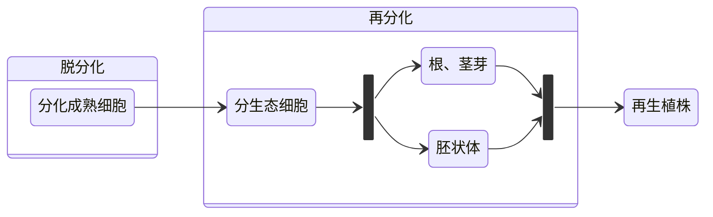

#### 思考问题

1. 为什么要学习植物组织培养；
2. 植物组织培养设计的内容；
3. 怎么样学好植物组织培养；

#### 学习策略

1. 练好扎实基本功（理论学习）；
2. 重视实验课（动手能力）；
3. 重视新知识的吸收与总结（网上纳新）；
4. 与理论和生产实践相结合（技术转化）；

## 目录与学习目标

​	本章分为如下部分：

```template:contents
[[self], 植物组织培养的概念]
[[self], 理论基础——植物细胞全能性]
[[self], 植物组织培养发展历史]
[[self], 植物组织培养技术应用]
```

​	本章的学习目标为：

1. 掌握植物组织培养基本概念；
2. 了解植物细胞的全能性；
3. 了解植物组织培养发展历史及应用；

## 一、植物组织培养的概念

### 1. 植物组织培养概念

​	**植物组织培养**是指在无菌和人工控制的环境条件下，利用人工培养基对离体的植物器官、组织、细胞及原生质体等进行培养，使其再生细胞或完整植株的技术。

​	**外植体**是指植物组织培养中作为离体培养起始材料的器官或组织的片段。

### 2. 植物组织培养特点

1. 培养条件可以人为控制，不受地区、季节限制；
2. 生长周期短，繁殖效率高；
3. 管理方便，利于工厂化生产和自动化控制；

### 3. 植物组织培养的分类

#### 按照培养对象分类

1. **胚胎培养**（embryo culture）：指从胚珠中分离出来的成熟和未成熟胚为外植体的离体无菌培养；
2. **器官培养**（organ culture）：指以植物的根茎叶，花，果实等器官为外植体的离体无菌培养；
3. **组织培养**（tissue culture）：指以分离出植物各部位的组织，分生组织，形成层，木质部，韧皮部，表皮等为外植体的离体无菌培养；
4. **细胞培养**（cell culture）：指以单个游离细胞为外植体的离体无菌培养；
5. **原生质体培养**（protoplast culture）：指以除去细胞壁的原生质体为外植体的离体无菌培养；

#### 按照培养方法分类

1. **固体培养**（solid culture）：以固体培养基为培养基质，培养对象为器官和组织，==主要用于形成再生植株==；
2. **液体培养**（liquid culture）：以液体培养基为培养基质，培养对象为植物细胞，==主要用于生产次生代谢产物==；

#### 按照培养过程

1. **初代培养**（primary culture）：指外植体最初接种于试管培养基中的第一次培养；
2. **继代培养**（subculture）：将初代培养得到的培养物移植于新鲜培养基中，这种反复多次移植的培养称为继代培养；
3. **生根培养**（rooting culture）：诱导无根组培苗产生根，形成完整植株的过程。目的是提高移栽后的成活率；

## 二、理论基础——**植物细胞全能性**

### 1. 植物组织培养的理论基础

​	**植物细胞全能性**（totipotency)：是指==任何生活的植物细胞，只要有完整的膜系统与细胞核，就拥有一整套发育成一个完整植株的遗传基础，并具备发育成完整植物体的潜在能力==。

​	研究表明，处于离体状态的植物活细胞，在一定的营养物质、激素和其他外界条件的作用下，就可能表现出全能性，发育成完整的植株。

> #### 植物细胞全能性
>
> 1. 对于植物细胞来说，不仅受精卵，体细胞也具有全能性。
>
> 2. 植物细胞表达全能性大小是==受精卵>生殖细胞>体细胞==。
>
> ​	根据细胞周期，植物细胞实现全能性能力分为如下三类：
>
> 1. **周期性细胞**：始终保持分裂能力，如茎尖、根尖分生区及形成层的细胞；
> 2. **$G_0$期细胞**：在通常情况下不分裂，但受到外界刺激后可重新启动分裂，如表皮细胞及各种薄壁细胞；
> 3. **终端分化细胞**；永久失去分裂能力，如筛管、导管、纤维、气孔、保卫细胞等特化细胞；

### 2. 植物的生命周期与全能性的体外表达

​	细胞（分裂分化）组织（组成）器官（构建）植物体。



> #### 植物细胞表达全能性的方式与过程
>
> 1. 表达的方式有：器官发生（小麦）或（和）胚胎发生（菊花）；
> 2. 表达过程须经：脱分化和再分化两个阶段；

## 三、植物组织培养发展历史

### 1. 探索阶段：(20世纪初—30年代中）

1. 1838-1839年，德国科学家 Schleide 施莱登 和 Schwann 施旺 发表了细胞学说，奠定了组织培养的理论基础。
2. 1902年，德国植物学家 Haberlandt 哈伯兰特 根据细胞学说，==提出植物细胞全能性（totipotency）理论==，被称为植物组培之父。
    1. 观点：高等植物的组织和器官可以分割成单个细胞；
    2. 贡献：==提出细胞全能性，首次进行离体细胞培养==；
    3. 实验：使用了**小野芝麻和凤眼兰的栅栏细胞 和 虎眼万年青属表皮细胞**，用 Knop+蔗糖培育发现没有分裂；
    4. 实验失败原因：**细胞高度分化+培养基中无生长激素**；
3. 1904年，Hanning 最先成功地培养了萝卜和辣根菜的胚。
4. 1922年，Knudson 采用胚培养法获得大量兰花幼苗。克服其种子发芽困难的问题。
5. 1925年：Laibach亚麻种间杂交幼胚培养得到杂种。

### 2. 建立阶段（20世纪30年代末—50年代中）

1. 1934年，美国植物生理学家 White 怀特（植物组织培养的奠基人）用番茄根尖建立起第一个活跃生长的无性繁殖系，从而使非胚器官的培养首先获得成功。
2. 1934年：法国学者 Gautherete 高斯雷特 培养山毛杨、黑杨形成层组织产生了 Callus（愈伤组织）。
3. 1937年：White 发现3种B族维生素和 IAA 对植物生长有作用。
4. 1939年：Gautherete 培养胡萝卜根外植体获得成功。
5. 1939年：White 培养烟草种间杂种幼茎切段原形成层成功。
6. 1939年：Nobecourt 诺博卡特 培养胡萝卜块茎薄壁组织成功。
7. 1948年，Skoog、崔瀓通过实验发现腺嘌呤可以促进愈伤组织生长，并诱导芽的形成。
8. 1955年，Miller 发现激动素（kinetin）。
9. 1957年，Skoog & Miller 提出了==激素调控理论==，认为根与茎的分化与 CTK/AUX（细胞分裂素、生长素）的比例关系有关。使得人为控制培养物分化方向成为可能。
10. 1958年，英国科学家 Steward 等用胡萝卜根的愈伤组织细胞进行悬浮培养，成功诱导出完整的小植株，不但==首次使细胞全能性理论得到证实==，而且为组织培养的技术程序奠定了基础。 

### 3. 迅速发展阶段（从20世纪50年代末—至今）

1. 1958年，英国科学家 Steward 等用胡萝卜根的愈伤组织细胞进行悬浮培养，成功诱导出胚状体并分化为完整的小植株。这是第一次实现人工体细胞胚，是植物组织培养的第一个突破。 
2. 1960年英国学者 Cocking 用酶法分离原生质体成功。这是植物组织培养的第二个突破。
    1. 同年，Morel 提出了离体快繁兰花的方法，造就 “兰花工业” 。现在微繁技术已经广泛用于各经济作物的生产，并==可以与植物脱毒技术结合起来在无毒种苗的繁育中发挥作用==。
3. 1962年，Murashinge 和 Skoog 在烟草培养中筛选出**至今仍被广泛使用的MS培养基**。
4. 1964-1966年，印度科学家 Guha 和 Maheswari 在曼陀罗花药培养中首次由花粉诱导得到了单倍体植株。
    1. 该技术主要用于**遗传育种**工作，==可大大缩短育种周期，提高效率==。
    2. 我国科学家在烟草、水稻、小麦的单倍体培养中取得了重要成绩。
5. 1972年，Carlson 通过两个种的烟草原生质体融合培养，获得了第一个体细胞杂交的杂种植株。

> #### 植物组培技术发展的原因
>
> ​	60年代以来，植物组培技术能够得到快速发展，很重要的一个原因就在于走出了实验室，==通过与良种选育、遗传育种和植物基因工程技术的结合==，在植物改良中发挥了重要作用。

> #### 我国发展情况
>
> ​	早期的李继侗、崔瀓、罗士伟等人都作了很多有价值的工作。
>
> ​	进入70年代以后，我国科学家在原生质体培养以及花药培养做出了举世公认的重要成绩，得到了世界同行的普遍重视和赞赏。
>
> ​	王伏雄、李正理、孙敬三、朱至清、许智宏、杨弘远、胡道芬、潘瑞炽、丁家宜等。

## 四、植物组织培养技术应用

​	植物组织培养技术应用广泛，地位重要的原因：

1. 能够从不同植物部位形成再生植株；

2. 能够进行大规模进行细胞悬浮培养；
3. 掌握了植物组织和细胞超低温保存的方法；
4. 建立了遗传转化方法，实现了基因转移；

### 1. 植物快速繁殖与工厂化育苗

1. 20世纪60年代初，欧洲“兰花工业”兴起
2. 美国：快繁公司250家，年生产各种花卉、苗木的能力为200万株-400万株；其中兰花、菊花及各种观叶植物，全部采用组培技术，每年菊花销售额为1.2亿美元。
3. 荷兰：快繁公司72家，全年生产各类试管苗8000万株。荷兰以球根花卉郁金香、洋水仙、小苍兰为主，均采用**工业化生产**，且能**反季节开花**。

### 2. 培育无病毒苗木

​	1960年Morel第一个用茎尖顶端分生组织培养法获得无病毒兰花后，组培技术就成为脱除植物病毒的理想方法。

> #### 目前已脱除病毒的植物有
>
> 1. 果树：柑橘、苹果、梨、草莓、树莓、香蕉、甘蔗等；
>
> 2. 蔬菜：马铃薯、大蒜、番茄；
>
> 3. 观赏植物：兰花、康乃馨、鸢尾、大丽花、矮牵牛；

### 3. 细胞培养生产次生代谢产物

​	目前通过细胞培养的植物种类已达100多种，所能鉴别的有用成分超过300种。

​	这些次生产物主要集中在==价格高，栽培困难、产量低、需求大的==**药品**，如人参皂苷、紫草宁、紫杉醇、黄酮。 其他一些次生产物如**香料**（小豆蔻油、玫瑰油和薰衣草精油）、**食品添加剂、颜料和树胶**。

### 4. 培育新品种或创制新种质

1. 作为转基因受体材料——转基因植株；
2. 花药培养——单倍体育种（水稻、小麦、高粱；百合、天仙子、草莓等）；
3. 突变体筛选与育种：
    1. 水稻：高赖氨酸突变体
    2. 辣椒：抗盐、抗低温突变体；
4. 细胞融合与育种——远缘杂交物种（属间杂交：马铃薯+番茄）；
