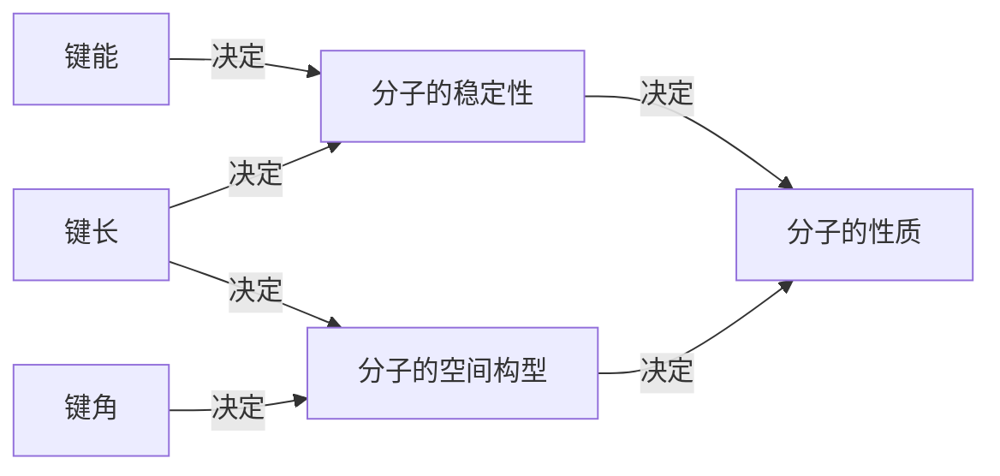

## 知识聚焦

### 一、化学键与分子间作用力

#### 1. 化学键与分子间作用力

|            | 化学键                   | 分子间作用力                       |
| ---------- | ------------------------ | ---------------------------------- |
| 概念       | 相邻原子间强烈的相互作用 | 把分子聚集在一起的力，又称范德华力 |
| 作用范围   | 分子或晶体内             | 分子间                             |
| 作用力强弱 | 较强                     | 比化学键弱得多                     |
| 影响的性质 | 主要影响化学性质         | 主要影响物理性质（如熔沸点）       |
| 特征       | 有方向性，有饱和性       | 无方向性，无饱和性                 |

1. 分子间作用力存在于由共价键形成的多数共价化合物和绝大多数非金属单质及稀有气体之间。
2. 一般来说，组成和结构相似的物质，相对分子质量越大，分子间作用力越大，物质熔沸点越高；分子的极性越大，分子间作用力越大。

#### 2. 化学键的分类

| 化学键类型 | 离子键                             | 共价键                           | 金属键                                           |
| ---------- | ---------------------------------- | -------------------------------- | ------------------------------------------------ |
| 概念       | 阴阳离子间通过静电作用形成的化学键 | 原子间通过共用电子对形成的化学键 | 金属**阳离子与自由电子**通过相互作用形成的化学键 |
| 成键微粒   | 阴阳离子                           | 原子                             | 金属阳离子和自由电子                             |
| 成键性质   | 静电作用                           | 共用电子对                       | 电性作用                                         |
| 形成条件   | 活泼金属元素与活泼非金属元素       | 非金属元素与金属元素             | 金属内部                                         |
| 实例       | $\ce{NaCl, MgO}$                   | $\ce{HCl, H2SO4}$                | $\ce{Fe, Mg}$                                    |

> ##### 有阴离子一定有阳离子，有阳离子不一定有阴离子（如金属单质或合金）。

#### 3. 共价键

|                    | 非极性共价键                       | 极性共价键                         | 配位键（配位共价键）                              |
| ------------------ | ---------------------------------- | ---------------------------------- | ------------------------------------------------- |
| 形成微粒           | 同种原子                           | 不同种原子                         | 不同种原子                                        |
| 成键方式           | 双方原子共同提供电子形成共用电子对 | 双方原子共同提供电子形成共用电子对 | 一方原子提供孤电子对，一方院子提供空轨道          |
| 表示               | $\ce{A-B}$                         | $\ce{A-B}$                         | $\ce{A:\bond{->}\square B}$（$\ce{A\bond{->}B}$） |
| 原子吸引电子对能力 | 相同                               | 不同                               | 不同                                              |
| 共用电子对位置     | 不偏向任何一个原子                 | 偏向吸引电子能力强的原子一方       | 偏向吸引电子能力强的原子一方                      |
| 举例               | $\ce{H2, N2, H2O2}$                | $\ce{HCl, OH-, H2O}$               | $\ce{NH+4, H3O+, H3N-BF3}$                        |

​	共价键业可以按照共用电子对的数目分为单键、双键、三键，也可以按照原子轨道的重叠方式分为$\sigma$键和$\pi$键（前者电子云具有轴对称性，后者电子云具有镜像对称性）。

#### 4. 化学键的键参数

1. 键能：气态基态原子形成$\ce{1mol}$化学键释放的最低能量。键能越大，化学键越稳定。
2. 键长：形成共价键的两个原子之间的核间距。键长越短，化学键越稳定。
3. 键角：在原子数超过2的分子中，两个共价键之间的夹角。

#### 5. 离子化合物和共价化合物

| 类别             | 离子化合物                                                   | 共价化合物                                                   |
| ---------------- | ------------------------------------------------------------ | ------------------------------------------------------------ |
| 定义             | 含有离子键的化合物                                           | 只含有共价键的化合物                                         |
| 结构粒子         | 阴阳离子                                                     | 原子                                                         |
| 化学键类型       | 一定含有离子键，可能含有共价键                               | 只含共价键                                                   |
| 与物质类别的关系 | 1. 强碱 2. 绝大多数盐 3. 活泼金属氧化物            | 1. 所有的酸 2. 弱碱 3. 气态氢化物 4. 非金属氧化物 5. 极少数盐 |
| 主要物理性质     | 1. 熔沸点较高，硬度较大，通常呈固态 2. 固态不导电，熔融态或溶于水后导电 | 1. 熔沸点、硬度差异较大 2. 熔融态不导电，某些溶于水后导电 |

### 二、分子的极性

#### 1. 非极性分子与极性分子

|                | 非极性分子                 | 极性分子                         |
| -------------- | -------------------------- | -------------------------------- |
| 形成原因       | 整个分子的电荷分布均匀对称 | 整个分子的电荷分布不均匀、不对称 |
| 存在的共价键   | 非极性键或极性键           | 极性键                           |
| 分子内原子排列 | 对称                       | 不对称                           |

> ### 分子极性的判断
>
> 1. 除了$\ce{O3}$，只含有非极性键的单质分子是非极性分子。
> 2. 含有极性键的双原子化合物分子都是极性分子。
> 3. 含有极性键的多原子分子，空间结构对称的是非极性分子，不对称的是极性分子。
> 3. 使用向量和进行计算，如果分子极性的向量和为0，则分子是极性分子。
> 3. 判断分子是否是极性分子不能只看分子式，需要看具体结构，如$\ce{H2O2}$不是平面构象，而是一个具有二面角的构象[@Why_H2O2_polar_molecules]。

> #### 相似相容原理
>
> ​	相似相容规律：凡是分子结构相似的物质，都是易于互相溶解的。（非极性溶质一般能溶于非极性溶剂，极性溶质一般能溶于极性溶剂；如果存在氢键，溶剂与溶质间氢键作用力越大，溶解效果越好）

> #### 键的极性对有机酸酸性的影响
>
> ​	有机酸中羟基可以电离出氢离子，羟基的极性越大，有机酸的酸性越大。
>
> 1. 因为$\ce{F}$的电负性大于$\ce{Cl}$，故而三氟乙酸中羟基基团的极性大于三氯乙酸的极性，酸性更强。
> 2. 烃基是推电子基团，烃基越长推电子效应越大，羟基极性越小，酸性越弱，所以甲酸酸性强于乙酸强于丙酸。

#### 2. 分子的空间构型

##### VSEPR 价层电子对互斥模型

​	价层电子对互斥模型认为，分子的空间结构是中心原子周围的价层电子对相互排斥的结果。价层电子对指分子中的中心原子与结合原子间的$\sigma$键电子对和中心原子上的孤电子对（不计$\pi$键电子对）。

​	中心原子上的$\sigma$键电子对数可以由化学式确定，而孤电子对数需要用计算式$0.5(a-xb)$得出（$a$为中心原子的价电子数，$x$为与中心原子结合的原子数，$b$为与中心原子结合的原子最多能接受的电子数）。

​	在计算得出价层电子对数后，我们可以构建一个含有孤电子对的分子的VSEPR模型，然后略去中心原子的孤电子对，我们就可以得到分子的空间构型。但由于孤电子对有较大斥力，中心原子含孤电子对分子的键角几乎都小于预测值，如$\ce{H2O=105\degree, NH3=107\degree, NO^-2=115\degree}$，虽然VSEPR预测少有失误，但它不能用来预测以过渡金属为中心原子的分子。

##### 杂化轨道理论

​	杂化轨道理论是一种价键理论，是鲍林为了解释分子空间结构而提出的，要点在于，如$\ce{CH4}$的碳原子与氢原子成键时，碳原子的$\ce{2s}$轨道和3个$\ce{2p}$轨道会发生混杂，形成四个能量一样，指向正四面体四个顶角的轨道，夹角$109\degree28’$。这种成键中心原子轨道杂化合并形成新的键长、键角、键能完全一致的轨道的理论即为杂化轨道理论。

> ##### 判断杂化类型
>
> ​	大多情况可以简化运算为$\ce{sp^{lp + \sigma - 1}}$（一般来说，杂化轨道数=中心原子上的孤电子对数+中心原子的$\sigma$键数）。

| 价层电子对数 | VSEPR      | 成键电子对 | 孤电子对 | 分子或离子结构 |
| ------------ | ---------- | ---------- | -------- | -------------- |
| 2            | 直线形     | 2          | 0        | 直线形         |
| 3            | 平面三角形 | 3          | 0        | 平面三角形     |
| 3            | 平面三角形 | 2          | 1        | V形            |
| 4            | 四面体形   | 4          | 0        | 正四面体形     |
| 4            | 四面体形   | 3          | 1        | 三角锥形       |
| 4            | 四面体形   | 2          | 2        | V形            |

### 三、氢键

#### 1. 定义

​	当氢与电负性很大而原子半径很小的元素$\ce{X}$（如$\ce{N, O, F}$）以共价键结合时，使共用电子对强烈偏向电负性大的原子一端，使氢原子几乎裸露在外面，这时氢原子核与另一个电负性很大，同时原子半径很小，且带有孤对电子的元素$\ce{Y}$接近时产生比较大的吸引力（强度约为一般共价键的5%~10%），这种原子间作用力称为**氢键**。氢键通常可以表示为$\ce{X-H\bond{...}Y}$。

​	简单来说，就是==氢原子被电负性很高的原子吸走了电子呈$\delta^+$，此时与另一个电负性很高的原子就能形成氢键==。

#### 2. 特点

1. 氢键具有方向性和饱和性。
2. 氢键只存在于某些含有氢原子的分子之间。
3. 作用力大小：==化学键>氢键>分子间作用力==。
4. 分子中心必须有一个电负性很大的元素形成强极性键的氢原子。
5. 电负性大的元素必须有孤对电子，且半径要小（通常为$\ce{F, O, N}$）。

#### 3. 影响

​	氢键对物质的熔点、沸点、密度、黏度、硬度等均有影响。

1. 若分子间存在氢键，晶体熔化或液体汽化时，需要克服的阻力增大，所以熔沸点升高。
2. 若分子内存在氢键，分子间不再缔合而凝聚力小，熔沸点低。
3. 极性溶剂中，如果溶质分子与溶剂分子间形成氢键，会促进分子间的结合，溶解度增大。
4. 极性溶剂中，如果溶质分子内形成氢键，会与水（溶剂）难以形成分子间氢键，进而难溶于水（溶剂），溶解度低。
5. 溶液中形成分子间氢键，使分子间结合更加紧密，进而增加密度与黏度。

### 四、分子的手性

​	具有完全相同的组成和原子排列的一对分子，如同左右手一样互为镜像，在三维空间内不能叠合，互称手性异构体（或对映异构体）。有手性异构体的分子叫做**手性分子**。

> ### 判断是否是手性碳原子
>
> 1. 手性碳原子必须饱和，连有4个不同原子或原子团。
> 2. $\ce{-CH2-, -CH3-}$一定不是手性碳原子。
> 3. 双键、三键以及苯环上的碳原子一定不是手性碳原子。

​	手性分子在生命科学和药物生产中有广泛应用，现今使用的药物有50%以上是手性药物，它们的一个异构体可能是有效的，另一个异构体可能是无效甚至有害的。使用手性催化剂可以只得到或主要得到一种手性分子，这种合成方式是手性合成。
