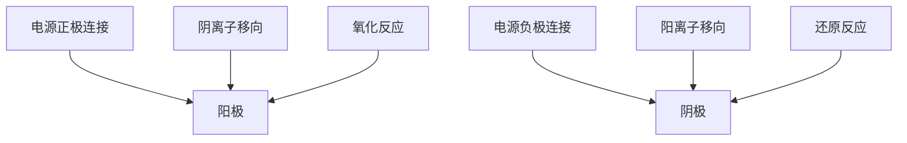

## 知识聚焦

### 一、原电池

#### 1. 原电池

**原电池**指将化学能转变为电能的装置。

#### 2. 原电池的构成

构成原电池的条件包括：

1. 两个活泼性不同的电极；（一个发生氧化反应，一个发生还原反应）
2. 电解质溶液或熔融电解质作为介质；（阴离子向负极移动，阳离子向正极移动）
3. 形成闭合回路
4. 存在自发的氧化还原反应
5. 原电池可以用**盐桥**连接两个反应池，也可以用**离子膜**隔离两个反应池，以实现反应独立不干扰和反应定向发生等目的。

> #### 原电池的分类
>
> 原电池可以分为一次电池、二次电池，一次电池中包括燃料电池。
>
> ##### 	1. 普通一次电池
>
> ###### 	Zn-Mn 碱性电池
>
> 负极：$\ce{Zn +2OH- - 2e- -> Zn(OH)2}$
>
> 正极：$\ce{2MnO2 +2H2O +2e- -> 2MnOOH +2OH-}$
>
> ##### 		2. 燃料电池
>
> ###### 		氢氧酸性电池
>
> 负极：$\ce{2H2 - 4e- -> 4H+}$
>
> 正极：$\ce{O2 + 4H+ + 4e- -> 2H2O}$
>
> ###### 		氢氧碱性电池
>
> 负极：$\ce{2H2 + 4OH- - 4e- -> 4H2O}$
>
> 正极：$\ce{O2 + 2H2O + 4e- -> 4OH-}$
>
> ###### 	甲烷酸性电池
>
> 负极：$\ce{CH4 + 2H2O - 8e- -> CO2 + 8H+}$
>
> 正极：$\ce{2O2 + 8H+ + 8e- -> 4H2O}$
>
> ###### 	甲烷碱性电池
>
> 负极：$\ce{CH4 + 10OH- - 8e- -> CO3^2- + 7H2O}$
>
> 正极：$\ce{2O2 + 4H2O + 8e- -> 8OH-}$
>
> ##### 		3. 二次电池（可充电、多次使用）
>
> ###### 	铅蓄电池
>
> 负极放电：$\ce{Pb(s) + SO4^2-(aq) - 2e- -> PbSO4(s)}$
>
> 正极放电：$\ce{PbO2(s) + 4H+(aq) + SO4^2-(aq) + 2e- -> PbSO4(s) + 2H2O(l)}$
>
> 阳极充电：$\ce{PbSO4(s) + 2H2O(l) - 2e- -> PbO2(s) + 4H+(aq) + SO4^2-(aq)}$
>
> 阴极充电：$\ce{PbSO4(s) + 2e- -> Pb(s) + SO4^2-(aq)}$
>
> ###### 	Ni-Cd 碱性蓄电池
>
> 总反应式：$\ce{Cd + 2NiO(OH) + 2H2O <=>[放电][充电] 2Ni(OH)2 + Cd(OH)2}$

### 二、电解池

#### 1. 电解原理及其应用

**电解**指电流通过电解质溶液或熔融电解质而在阴阳两极引起氧化还原反应的过程。

**电解池**指将电能转变为化学能的装置。

> ### 书写原电池、电解池反应式的快捷方法
>
> **加和性原则**：燃料电池一般先写正极反应和总反应式，减去后即可得到较难书写的负极反应式。电解池中同理用电解总反应减去阴极反应式即可得到阳极反应式。

> ### 原电池和电解池的判断方法
>
> 1. 先分析有无外接电源。存在外接电源的是电解池，无外接电源的是原电池。
> 2. 再看是否满足电解溶液或熔融电解质供导电，是否是闭合回路，是否有活泼性差异。
> 3. 多池相连而无外电源时，两极活泼性差异最大的是原电池，其他都可看作是电解池。

#### 2. 电解规律

##### 1. 电极类型

惰性电极：电极只导电不发生反应；

非惰性电极：主要指金属活动顺序表中排在$\ce{Pt}$前的金属单质（活泼金属$\ce{K, Ca, Na}$之外）。

##### 2. 放电顺序

==阳极产物：活性阳极金属 ⇒ 无氧酸根离子 ⇒ $\ce{OH-}$ ⇒ 【熔融电解质下：含氧酸根离子 ⇒ $\ce{F-}$】，即：==

1. 金属材料做阳极（除了惰性金属$Pt$等）先被氧化成金属离子而溶解。
2. 惰性电极下简单阴离子（$\ce{S^{2-}>I^->Br^->Cl^-}$）电势虽然比$\phi(\ce{H^+/H2})$大，但是因为$\ce{OH^-}$浓度及$\ce{O_2}$超电势较大，因此阳极可以优先析出这些简单阴离子对应的物质（$\ce{S, I2, Br2, Cl2}$）。
3. 惰性电极下，溶液存在含氧酸根离子，电极电势大于$\phi(\ce{H^+/H2})$，在阳极不易被氧化。

==阴极产物：金属离子【 ⇒ 浓度大（电镀等）下的 $\ce{Pb^2+ > Sn^2+ > Fe^2+ > Zn^2+}$】 ⇒ $\ce{H+}$ ⇒ 【 熔融电解质下 $\ce{Al^3+ > Mg^2+ > Na^+ > Ca^2+ > K^+}$】，即：==

1. 电极电势比$\phi(\ce{H^+/H2})$大的先被还原。
2. 电极电势比$\phi(\ce{H^+/H2})$小的金属阳离子（$\ce{Pb^2+ > Sn^2+ > Fe^2+ > Zn^2+}$）因为$H_2$超电势较大，这些阳离子析出电势仍可能大于$\ce{H^+}$的析出电势，所以这些金属也会先析出。
3. 电极电势很小的金属离子（$\ce{Al^3+ > Mg^2+ > Na^+ > Ca^2+ > K^+}$）在阴极不易被还原。

> ### 电解池产物判断
>
> 1. 阳极产物：
>
>    1. 阳极为活泼金属（除了$\ce{Pt, Au}$），则活泼金属失电子，电极溶解。
>    2. 阳极为惰性电极，则看阴离子的还原性，$\ce{S^2- > I- > Br- > Cl- > OH- (H2O)}$，非溶液考虑 $\ce{NO3- > SO4^2- > CO3^2- > F-}$。
>
> 2. 阴极产物：
>
>    看溶液中阳离子的氧化性强弱，$\ce{Ag+ >Hg+ > Fe^3+ > Cu^2+ > Pb^2+ > H+ > Sn^2+ > Fe^2+ > Zn^2+ > H+ (H2O)}$，非溶液考虑 $\ce{Al^3+ > Mg^2+ > Na+ > Ca^2+ > K+}$。

> #### 电解原理的应用
>
> | 电解食盐水                                                   | 电镀                                                         | 电解精炼铜                                                   | 电冶金属                                                     |
> | ------------------------------------------------------------ | ------------------------------------------------------------ | ------------------------------------------------------------ | ------------------------------------------------------------ |
> | $\ce{2NaCl + 2H2O ->[电解] 2NaOH + H2 ^ + Cl2 ^}$            | -                                                            | -                                                            | $\ce{2NaCl(熔融) ->[电解] 2Na + Cl2 ^}$                      |
> | 1. 阴阳极需要用阳离子交换膜隔离（只允许$\ce{Na+}$通过，避免$\ce{H2, Cl2}$混合爆炸和$\ce{Cl2, NaOH}$反应。 2. 食盐水需要纯化，除去$\ce{Mg^2+, Ca^2+, Fe^2+, SO4^2-}$等离子。| 1. 镀件作阳极，溶解。 2. 用含镀层阳离子的溶液作电镀液。 3. 电镀液浓度保持不变。| 1. 粗铜作阳极，溶解。 2. 精铜作阴极。 3. 阳极泥包括$\ce{Ag, Au}$等，电解液$\ce{[Cu^2+}]$会不断减小，要定期更换。 4. 阳极减少$\ce{Cu}$的质量小于阴极增加的质量$\ce{Cu}$ | 1. 电解含有离子键的金属化合物，如$\ce{NaCl}$、$\ce{Al2O3}$。 2. $\ce{AlCl3}$不含有离子键，不能制备金属单质。|

### 三、金属腐蚀与防护

#### 1. 金属的腐蚀

金属的腐蚀指金属单质失去电子形成金属阳离子的过程，分为化学腐蚀和电化学腐蚀，两者**同时存在并以电化学腐蚀为主**。

> #### 吸氧腐蚀和析氢腐蚀
>
> 钢铁的电化学腐蚀包括析氢腐蚀和吸氧腐蚀，均氧化为$\ce{Fe^{II}}$，但吸氧腐蚀会进一步转变为氢氧化铁，最后失去一部分水后形成铁锈。
>
> 另外，在自然界中一般两者同时存在同时发生，并以吸氧腐蚀为主。
>
> |            | 吸氧腐蚀                       | 析氢腐蚀                 |
> | ---------- | ------------------------------ | ------------------------ |
> | 电解液     | 碱性、中性或弱酸性             | 较强酸性                 |
> | 正极反应式 | $\ce{O2 + 2H2O + 4e- -> 4OH-}$ | $\ce{2H+ + 2e- -> H2 ^}$ |

#### 2. 金属的防护

1. 改变金属的内部结构（如钢中添加$\ce{Cr, Ni}$制成不锈钢）。
2. 在金属表面覆盖镀层：
   1. 钢铁表面涂矿物性油脂、油漆或覆盖搪瓷、塑料等物质。
   2. 电镀、热镀、喷镀等方式镀上一层不易被腐蚀的金属。
   3. 用化学方法是钢铁表面钝化生成致密稳定的氧化膜。
3. 电化学保护法：
   1. **外加电流**的阴极保护法（向阴极提供电子，即负极接被保护的金属）。
   2. **牺牲阳极**的阴极保护法（形成原电池，让被保护的金属成为电池正极）。

> ###### 金属腐蚀的规律
>
> 1. 同一电解质溶液中腐蚀强度：电解原理引起腐蚀>原电池原理引起腐蚀>化学腐蚀>有防护措施的腐蚀。
> 2. 不同溶液中腐蚀强度：金属在强电解质溶液中的腐蚀>金属在弱电解质溶液中的腐蚀>金属在非电解质溶液中的腐蚀。
> 3. 有保护措施下的腐蚀强度：无防护措施的腐蚀>一般防护措施下的腐蚀>牺牲阳极法下的腐蚀>外加电流法下的腐蚀。
