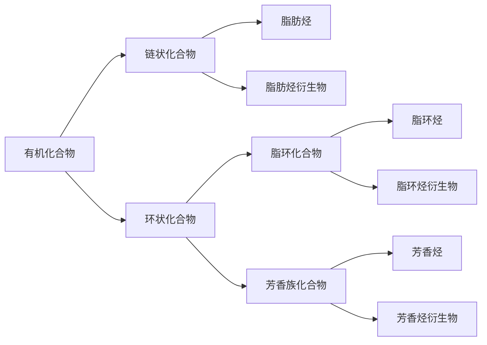

## 知识聚焦

###   一、有机化合物的分类方法

#### 1. 按照碳骨架分类

​	根据碳原子组成的分子骨架，有机化合物可以分成链状化合物和环状化合物。链状化合物可以继续细分为脂肪烃和脂肪烃衍生物，脂环化合物包括脂环烃和脂环烃衍生物，芳香族化合物包括芳香烃和芳香烃衍生物。

#### 2. 按照官能团分类

​	烃分子中的氢原子可以被其他原子或原子团取代，得到烃的衍生物。像甲醇羟基决定其常温下为液体，与水互溶，与羧酸反应生成酯这样有机化合物特性的原子或原子团叫**官能团**，如下是常见官能团：

| 类别       | 具体名称 | 官能团                                                       | 代表物                                            | 鉴别方法                                                     |
| ---------- | -------- | ------------------------------------------------------------ | ------------------------------------------------- | ------------------------------------------------------------ |
| 烃         | 烷烃     | -                                                            | 甲烷 $\ce{CH4}$                                   | -                                                            |
|            | 烯烃     | 碳碳双键$\chemfig{C=[0,.7]C}$                                | 乙烯 $\ce{CH2\bond{=}CH2}$                        | $\ce{Br2}$的四氯化碳溶液：红棕色退去； 酸性$\ce{KMnO4}$溶液：紫红色退去。|
|            | 炔烃     | 碳碳三键$\ce{-C\bond{3}C-}$                                  | 乙炔$\ce{CH\bond{3}CH}$                           | $\ce{Br2}$的四氯化碳溶液：红棕色退去 酸性$\ce{KMnO4}$溶液：紫红色退去。|
|            | 芳香烃   | -                                                            | 苯 $\chemfig{*6([0,.5]-=-=-=)}$              |                                                              |
| 烃的衍生物 | 卤代烃   | 碳卤键                                                       | 溴乙烷$\ce{CH3CH2Br}$                             | $\ce{NaOH}$溶液、稀硝酸和硝酸银溶液：生成沉淀。             |
|            | 醇       | 羟基$\ce{-OH}$                                               | 乙醇$\ce{CH3CH2OH}$                               | $\ce{Na}$：有氢气放出； 与乙酸、浓硫酸反应：有水果香味物质生成。|
|            | 酚       | 羟基$\ce{-OH}$                                               | 苯酚 $\chemfig{*6([0,.5]-=-=(-[2,.5]OH)-=)}$ | $\ce{FeCl3}$溶液：紫色； 与浓溴水反应：生成白色沉淀。  |
|            | 醚       | 醚键 $\chemfig{O(-[7,.7]R)(-[5,.7]R)}$                  | 乙醚$\ce{CH3CH2OCH2CH3}$                          |                                                              |
|            | 醛       | 醛基 $\chemfig{C(-[0,.7]H)(=[2,.7]O)}$                  | 乙醛$\ce{CH3CHO}$                                 | 银氨溶液：有银镜生成； 新制$\ce{Cu(OH)2}$溶液：砖红色沉淀。|
|            | 酮       | 酮羰基 $\chemfig{C(=[2,.7]O)(-[7,.7]C)(-[5,.7]C)}$      | 丙酮$\ce{CH3COCH3}$                               |                                                              |
|            | 羧酸     | 羧基 $\chemfig{C(=[2,.7]O)(-[7,.7]OH)(-[5,.7]R)}$       | 乙酸$\ce{CH3COOH}$                                | 紫色石蕊试剂：变红； $\ce{NaHCO3}$溶液：生成$\ce{CO2}$气体。|
|            | 酯       | 酯基 $\chemfig{C(=[2,.7]O)(-[7,.7]OR)(-[5,.7]R')}$      | 乙酸乙酯$\ce{CH3COOCH2CH3}$                       |                                                              |
|            | 胺       | 氨基$\ce{-NH2}$                                              | 甲胺$\ce{CH3NH2}$                                 |                                                              |
|            | 酰胺     | 酰胺基 $\chemfig{C(=[2,.7]O)(-[7,.7]NH_2)(-[5,.7]R)}\quad\chemfig{C(=[2,.7]O)(-[7,.7]NH-[1,.7]R')(-[5,.7]R)}$ $\chemfig{C(=[2,.7]O)(-[7,.7]N(-[1,.7]R')(-[6,.7]R''))(-[5,.7]R)}$ | 乙酰胺$\ce{CH3CONH2}$                             |                                                              |
|            | 氰       | 氰基$\ce{-CN}$                                               | 氰化钾$\ce{KCN}$                                  | 稀碱溶液，加热：有$\ce{NH3}$放出。                          |

### 二、有机化合物中的共价键

#### 1. 共价键的类型

​	有机化合物中的共价键有两种基本类型：$\sigma$键和$\pi$键，有机化合物中不管以何种方式成键，碳原子总是形成 4 条共价键，氢原子只能形成一条，氧原子形成 2 条，氮原子形成 3 条。*碳原子成键方式的多样性导致了有机物的结构多样性，是有机物种类繁多、数量巨大的主要原因*。

> ### 成键数目
>
> ​	有机物中，$\ce{C}$成四个价键，$\ce{H,X}$成一个价键，$\ce{O}$成两个价键，$\ce{N}$成三个价键。

> ### 共面共线
>
> ​	与碳碳三键直接相连的原子有四个（$\ce{R-C\bond{3}C-R}$），共线。
>
> ​	与碳碳双键直接相连的碳原子共面。

#### 2. 共价键的极性与有机反应

​	由于不同成键原子间电负性的差异，共用电子对会发生偏移，偏移程度越大，共价键的极性越强，在反应中越容易发生断裂，因此有机化合物的官能团及其邻近的化合键往往是发生化学反应的活性部位。

​	共价键的断裂需要吸收能量，且有机化合物分子中共价键断裂的位置存在多种可能，相比无机反应，有机反应一般速率小，副反应多，产物复杂。

### 三、有机化合物的同系物和同分异构现象

​	我们把结构、化学性质相似，通式相同，组成上相差 1 个或若干个$\ce{CH2}$原子团，具有相同官能团的化合物称为同系物。

​	化合物具有相同的分子式，但有不同的结构的现象即为**同分异构现象**，具有同分异构现象的化合物互称同分异构体。有机化合物的同分异构现象主要包括**构造异构（碳架异构与位置异构）和立体异构（顺反异构和对映异构）**。同分异构现象在有机化合物中十分普遍，也是有机化合物数量非常庞大的原因之一。

> #### 同分异构现象
>
> ##### 碳链异构
>
> ​	由于分子中碳原子排列顺序不同而产生的同分异构体。
>
> ##### 位置异构
>
> ​	由于官能团位置不同而产生的同分异构体。
>
> ##### 官能团异构
>
> ​	由于官能团不同而产生的同分异构体。
>
> ##### 顺反异构
>
> ​	当烯烃中$\ce{C=C}$两个碳原子都连有两个不同原子或基团，由于双键不能自由旋转而产生的同分异构体。
>
> ##### 对映异构
>
> ​	构造相同，构型不同，互成镜像对映关系的立体异构现象。

> ### 确定同分异构体数量与书写同分异构体的常用方法
>
> ##### ==1. 取代法==（**等效氢**）
>
> ​	本质是将同分异构体看作是由官能团取代烃中的不同氢而形成的（适用于卤代烃、醇、醛、羧酸等有机物）：
>
> 1. 写出有机物的碳链结构。
> 2. 利用等效氢规律判断可以被取代的氢的种类（=取代位置数=同分异构体数）。
>
> ---
>
> ##### 2. 插入法（类似）
>
> ​	适用于酯、醚、酮、烯、炔等官能团镶在碳链中的有机物同分异构体的书写。
>
> 1. 将官能团取出。
> 2. 写出剩下部分的碳链结构。
> 3. 利用对称规律找出可插入官能团的位置（对称位置不重复插入）。
>
> ---
>
> ##### 3. 基团组装法（适用于特殊题目）
>
> ​	通常在给出组成有机物的基团，按照题意推出有机物的可能结构种类或结构简式的题目中方便。
>
> ​	首先，先确定基团等级，按游离键多少可将基团分为三类：
>
> 1. 端点基（只含一个游离键 ，如卤原子、$\ce{-CH3}$、$\ce{-OH}$ ……）
>
> 2. 桥梁基（含二个游离键，如$\ce{-CH2-}$、$\ce{-O-}$、$\ce{-⏣-}$……）
>
> 3. 中央基（含三个及以上游离键，如$\chemfig{C(-[0,.5]H)(-[2,.5]H)(-[4,.5]H)(-[6,.5]H)}$）
>
> ​	随后构建分子雏形，将所有端点基与中央基连接。若含有多个中央基，则先彼此连接，再接端点基。
>
> ​	第三编号定位，对可插入桥梁基的碳碳键位置进行编号，以示区别。
>
> ​	最后插入组合，按一定的方式将桥梁基插入端点基与中央基之间，即得可能的结构。
>
> ---
>
> ##### ==4. 基元法==（适用于烃的简单衍生物）
>
> ​	醇、醛、酸、卤代烃等烃的衍生物，均可以表示为$\ce{R-A}$的形式，则其同分异构体就是烃基（$\ce{R-}$）变化造成的，烃基的种数就是同分异构体数。
>
> ​	甲基($\ce{-CH3}$)、乙基($\ce{-C2H5}$) 、丙基($\ce{-C3H7}$) 、丁基($\ce{-C4H9}$)、戊基($\ce{-C5H11}$)的同分异构体数目分别为１、１、２、４、８。
>
> ​	例子：判断$\ce{C5H11Br}$的同分异构体数目：先分离出戊基，有 8 个同分异构体数，即为$\ce{C5H11Br}$的同分异构体数了。
>
> ---
>
> ##### ==5. 定一移二法==（**有序思维**）
>
> ​	含有两个或两个以上取代基的同分异构体的书写，只凭想象可能会重、漏，使用定一议二法会更为方便。
>
> ​	定一移二法是指当有机物有２个取代基时，先固定一个取代基的位置，再移动另一取代基的位置，从而可确定同分异构体的数目。分析二元取代物时，先写出一元取代物的结构简式，再在一元取代物的基础上移动第二个取代基位置。注意位置不能重复计算。
>
> ---
>
> ##### ~~6. 不饱和度法~~（不推荐）
>
> ​	计算分子不饱和度，根据不饱和度分析可能存在的结构。
>
> ​	不饱和度：对于有机物 $\ce{C_xH_yO_m(NH)_n}$，$\Omega = x+1-\dfrac{y}{2}$（不考虑氧，卤素当做 $\ce{H}$，氮同时划去 $\ce{NH}$）。
>
> ​	同时，对于有机物，$\Omega = x + 2y + z$，$x$：双键数；$y$：三键数；$z$：环数。
>
> ​	==通过不饱和度可以快速计算分子式（用饱和氢数减不饱和度的两倍）==。
>
> ---
>
> ##### 7. 等价代换法（**等效替代**）
>
> ​	用相关联的等量关系或对应因子代替，进行推理分析或计算的方法。若有机物分子可被取代的氢原子有$y$个，一取代物数量与$(y-1)$取代物的数量相同，$n$取代物的数目与$(y-n)$取代物的数目相同。如：$n=2$，丙烷（$y=8$）$\ce{CH3CH2CH3}$的二氯取代物$\ce{C3H6Cl2}$的同分异构体的数目同六氯取代物$\ce{C3H2Cl6}$相同。
